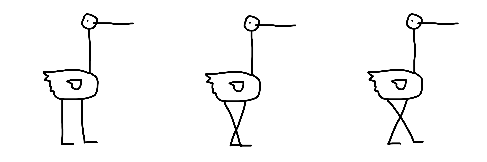
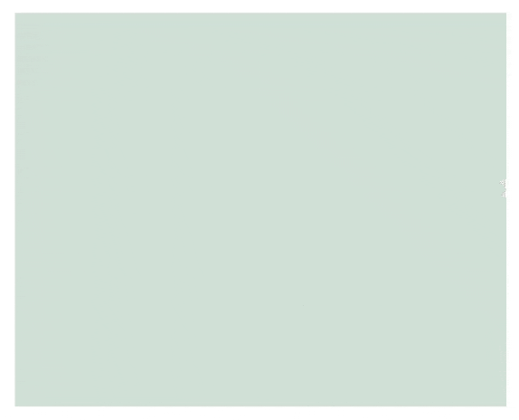
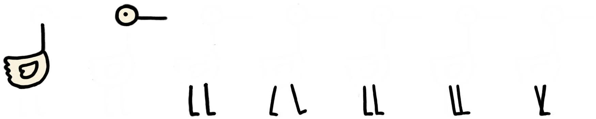
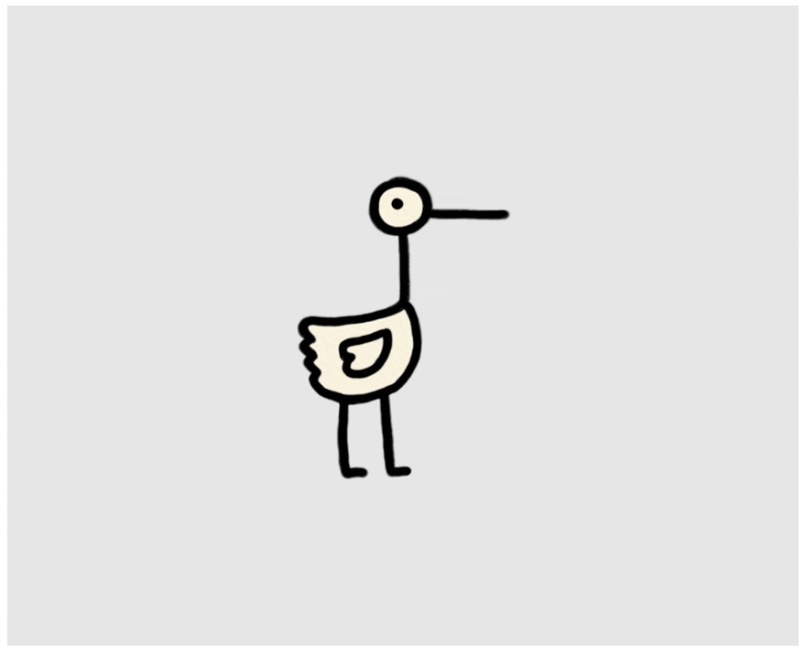
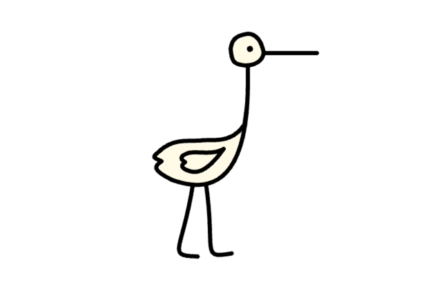
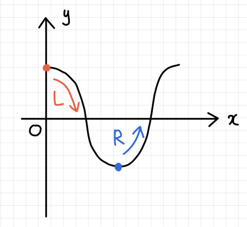
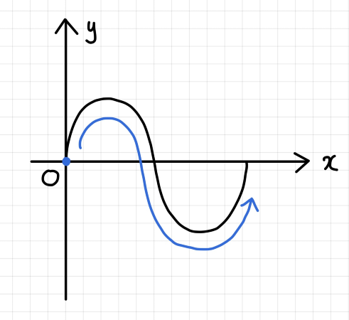
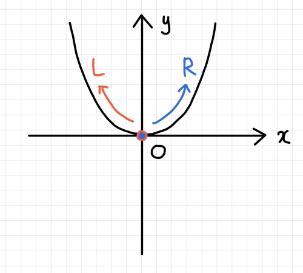
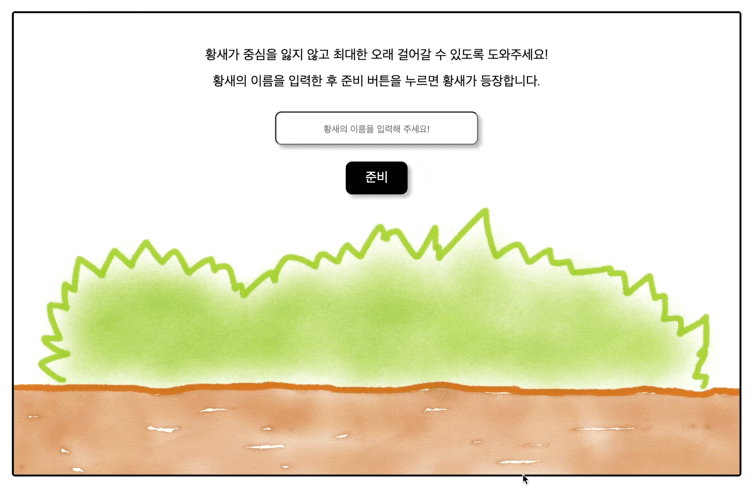
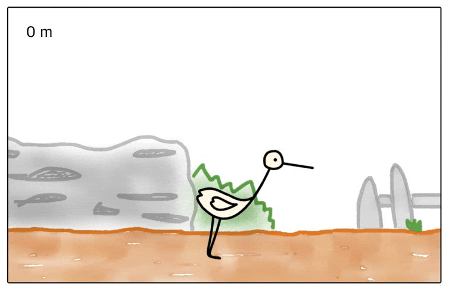

# 🐦 황새의 여정

- [🐦 황새의 여정](#-황새의-여정)
  - [🚪 Summary](#-summary)
  - [💡 Motivation](#-motivation)
  - [📆 Schedule](#-schedule)
    - [**1주차**](#1주차)
    - [**2주차**](#2주차)
    - [**3주차**](#3주차)
  - [⚙️ Tech Stack](#️-tech-stack)
  - [🚨 Issue & Handling](#-issue--handling)
    - [**황새 캐릭터 생성 & 요소 분리**](#황새-캐릭터-생성--요소-분리)
  - [🔥 Challenge](#-challenge)
    - [**황새 캐릭터 움직임 & 조작 기능 구현**](#황새-캐릭터-움직임--조작-기능-구현)
      - [**3rd Party 물리 엔진을 사용하지 않은 이유**](#3rd-party-물리-엔진을-사용하지-않은-이유)
      - [**황새 기본 움직임**](#황새-기본-움직임)
      - [**황새 조작 기능**](#황새-조작-기능)
  - [🕹 How to play](#-how-to-play)
    - [게임 준비 및 시작](#게임-준비-및-시작)
    - [게임 진행](#게임-진행)
    - [게임 종료](#게임-종료)

## 🚪 Summary

스스로 중심을 잡지 못 하는 황새가 쓰러지지 않고 최대한 멀리 걸어갈 수 있도록 방향키로 그 움직임을 조작하는 **웹 게임**입니다.

황새의 여정, 함께 떠나볼까요❓

## 💡 Motivation

- 어렸을 때부터 다양한 게임을 즐겨 했던 저는 지금도 취미로 게임을 하는 것을 굉장히 좋아합니다. 그래서 개발 공부를 시작한 후로 언젠가 한 번은 제가 **직접 게임을 만들어 보고**, 그 게임을 **많은 사람들이 재미있게 즐기는 모습**이 보고 싶었습니다.
- 저는 특히 **플래시 게임**을 좋아하는데, 복잡한 회원가입 절차가 없어서 빠르게 게임을 시작할 수 있고, 간단한 조작법과 단순한 규칙으로 누구나 게임에 참여할 수 있으며, 한 게임 당 소요되는 시간이 길지 않기 때문에 짧은 시간에도 게임을 즐길 수 있기 때문입니다.
- **2주라는 짧은 개발 기간** 동안 구현할 수 있는 게임으로써 플래시 게임이 가장 적합하다고 판단했습니다.
- 우연히 "황새 오래 걷기"라는 플래시 게임을 접하게 되었는데, **간단한 조작법**과 **단순한 규칙**으로 인해 많은 사람들이 쉽게 참여하여 즐길 수 있고, **짧은 시간에 높은 몰입도**를 끌어올릴 수 있으며, 사용자로 하여금 **웃음을 유발할 수 있는 요소**가 포함되어 있다는 점이 마음에 들어 이를 모티브로 "황새의 여정" 프로젝트를 진행하게 되었습니다.

## 📆 Schedule

전체 일정: 2021.09.27 ~ 2021.10.15(약 3주)

### **1주차**
: 2021.09.27 ~ 2021.10.03

- 아이디어 수집 및 검증
- 기술 스택 결정
- Mockup 작업
- KANBAN 생성

### **2주차**
: 2021.10.04 ~ 2021.10.10

- 개발
  - 게임 보드 생성
  - 게임 배경, 황새 캐릭터 생성
  - 게임 준비 및 시작 기능 구현

### **3주차**
: 2021.10.11 ~ 2021.10.15

- 개발
  - 황새 움직임 조작 기능 구현
  - 게임 진행 및 종료 기능 구현
  - 배경음, 효과음 추가
- 배포
- 리팩토링
- Test 작성
- README 작성

## ⚙️ Tech Stack

- ES6+
- React
- Styled-Components
- Prop-Types
- PixiJS
- ESLint
- Husky

## 🚨 Issue & Handling

### **황새 캐릭터 생성 & 요소 분리**

처음에는 png 파일을 로딩하여 하나의 PIXI.Sprite 객체를 생성함으로써 **정적**인 황새 캐릭터를 만들었습니다. 그리고 황새가 걸어가는 **동적**인 애니메이션 효과를 구현하기 위해 교차된 다리 모양을 갖는 PIXI.Sprite 객체를 추가로 생성하여 교대로 렌더링하였습니다.

그런데 하나의 PIXI.Sprite 객체는 **회전축을 1개만 갖기 때문**에 rotation 효과 적용 시 황새가 통째로 회전되어 휘청거리는 움직임을 자연스럽게 구현할 수 없다는 문제가 발생하였고, 이를 해결하기 위해 황새의 머리, 몸통, 다리 요소를 분리하기로 결정했습니다.

**황새의 머리, 몸통, 다리 요소를 분리**함으로써 **회전축의 개수를 3개로 늘렸고**, 황새가 걸어가는 움직임을 더 부드럽게 표현하기 위해 교차되는 다리의 모양을 다섯 종류로 늘리자 총 7개의 png 파일이 생성되었습니다. 이후 TexturePacker tool을 사용하여 7개의 png 파일을 하나로 packing하였고(93KB → 60KB), 애니메이션 정보를 담은 JSON data 파일을 통해 PIXI.AnimatedSprite 객체를 생성함으로써 황새가 자연스럽게 걷는 움직임을 구현했습니다.

그러나 png 파일로 생성한 객체로는 부드러운 움직임을 구현하는 데 제약이 많다고 판단되어 **캔버스 드로잉 방식**을 통해 황새 캐릭터를 생성하기로 결정했습니다.

우선 캔버스로 머리, 몸통, 날개, 왼쪽 다리, 오른쪽 다리 요소를 각각 드로잉함으로써 **5개의 회전축이 생성**되었고, PIXI.Container를 사용하여 머리, 몸통, 날개를 하나의 객체로, 왼쪽 다리와 오른쪽 다리를 하나의 객체로 묶음으로써 **2개의 회전축이 추가로 생성**되었습니다. 이렇게 생성된 **총 7개의 회전축을 컨트롤**함으로써 최종적으로 황새의 부드러운 움직임을 구현할 수 있게 되었습니다.

## 🔥 Challenge

### **황새 캐릭터 움직임 & 조작 기능 구현**

#### **3rd Party 물리 엔진을 사용하지 않은 이유**

- 황새 캐릭터의 움직임과 조작 기능을 구현함에 있어서 물리 엔진이 제공하는 가속도, 중력, 관성 등의 속성을 이용할 수도 있었지만, 로직적으로 제가 직접 구현할 수 있는 부분에서는 최대한 라이브러리나 엔진 등의 기술을 사용하지 않음으로써 **불필요하게 스펙이 넘치는 것을 막고 싶었습니다**.
- 개인적으로 이번 프로젝트에서 도전해 보고 싶었던 부분이 **수학 공식을 녹여낸 로직을 작성**함으로써 **자체적인 물리 엔진을 구현**하여 **현실 세계의 물리 법칙을 제가 만든 프로젝트 세계 안에 적용**시키는 것이었기 때문에 3rd Party 물리 엔진을 사용하지 않기로 결정했습니다.

#### **황새 기본 움직임**

- **걷기**: 양쪽 다리의 **반복적인 움직임**을 구현하기 위해 각각의 위치 좌표 및 회전각 변량에 **cosine 삼각함수** 적용
  - **왼쪽 다리**
    - **위치 좌표**: 초기값을 **0**으로 갖는 x값을 매 프레임마다 일정하게 증가시키고, 그에 대응하는 y값을 위치 좌표의 x좌표에 가산하여 **일정 범위 내(130 ~ 110)에서 반복적으로 수평 이동하도록 구현**
    - **회전각 변량**: 위치 좌표 컨트롤에 사용되는 x값으로 계산한 최초의 회전각 변량 **0.03 radian**을 시작으로 **-0.03 radian**까지 **반복적으로 증감**
  - **오른쪽 다리**
    - **위치 좌표**: 초기값을 **Math.PI**로 갖는 x값을 매 프레임마다 일정하게 증가시키고, 그에 대응하는 y값을 위치 좌표의 x좌표에 가산하여 **일정 범위 내(110~130)에서 반복적으로 수평 이동하도록 구현**
    - **회전각 변량**: 위치 좌표 컨트롤에 사용되는 x값으로 계산한 최초의 회전각 변량 **-0.03 radian**을 시작으로 **0.03 radian**까지 **반복적으로 증감**

- **날갯짓**: 날개의 반복적인 움직임을 구현하기 위해 회전각 변량에 **sine 삼각함수** 적용
  - 날개에 적용되는 회전각 변량의 초기값은 0으로, 황새가 움직이기 시작하면 0부터 시작하는 x값을 매 프레임마다 일정하게 증가시키고 그에 대응하는 y값(= **0.02 * Math.sin(x)**)을 직전 회전각에 더하여 날개가 **일정한 각도 범위 내에서 위, 아래로 반복적인 움직임을 나타내도록 구현**

- **가속도**: 황새의 기울어지는 움직임 구현 시 **중력에 의한 가속도 효과**를 위해 머리, 몸통, 다리의 회전각 변량에 **이차함수** 적용
  - 머리, 몸통, 다리의 회전각 변량의 초기값은 0.004로, 황새가 움직이기 시작하면 0부터 시작하는 x값을 기울어지는 방향에 따라 매 프레임마다 일정하게 증가/감소시키고 그에 대응하는 y값(= **17 * Math.pow(x, 2)**)을 직전 회전각에 더하여 황새가 기울어질 때 중력이 적용되어 **지면과 가까워질수록 빠른 속도로 기울어질 수 있도록 구현**
  - 회전각 변량 비율은 **머리 : 몸통 : 다리 = -2 : 3 : 1**로 적용함으로써 머리를 몸통 회전 방향과 반대로 회전시켜 자연스럽게 **정면을 응시**하도록, 그리고 몸통 회전량 대비 머리와 다리의 회전량 비율을 낮추어 **현실 세계의 황새가 기울어지는 것처럼** 구현

- **불규칙성**: 이차함수에 적용되는 x값의 절댓값이 특정값(= 0.013)을 초과하면 황새에 적용되는 가속도의 크기를 줄이거나, 회전각이 일정 범위 내에 포함되는 경우 황새를 빠르게 회전시킴으로써 **사용자의 순발력을 요하는 게임적인 요소 추가**

#### **황새 조작 기능**

- 황새가 기울어지는 방향과 키보드 조작 방향의 일치 여부에 따라 **회전각을 가감**하여 조작 기능 구현
  - 기울어지는 방향과 키보드 조작 방향이 **일치하는 경우**: 기울어지는 방향이 **오른쪽**이면 일정량의 회전각을 **가산**하고, **왼쪽**이면 **감산**하여 기존 방향으로 더 빠르게 회전하도록 구현
  - 기울어지는 방향과 키보드 조작 방향이 **일치하지 않는 경우**: 키보드 조작 방향이 **오른쪽**이면 회전각 변량에 특정한 **양수**를, **왼쪽**이면 **음수**를 대입한 후, **변량의 부호가 반대로 바뀔 때까지 회전각을 가감**하여 황새 움직임 조작 기능 구현

## 🕹 How to play

### 게임 준비 및 시작

- 황새의 이름을 입력한 후 준비 버튼을 클릭하거나 엔터키를 누르면 게임 준비가 완료되고, 잠시 후 황새가 등장합니다.
- 황새가 등장한 후 스페이스바를 누르면 게임이 시작됩니다.

### 게임 진행

- 황새가 기울어지는 방향의 반대쪽 방향키를 눌러 황새가 쓰러지지 않도록 조작합니다.
- 게임 보드의 왼쪽 상단에 황새가 걸어간 거리가 표시됩니다.

### 게임 종료

- 황새가 쓰러지면 게임이 종료됩니다.
- 게임 보드의 왼쪽 상단에는 최종 거리가, 중앙 상단에는 상위 5위까지의 랭킹이, 오른쪽 상단에는 게임을 다시 시작할 수 있는 버튼이 표시됩니다.
